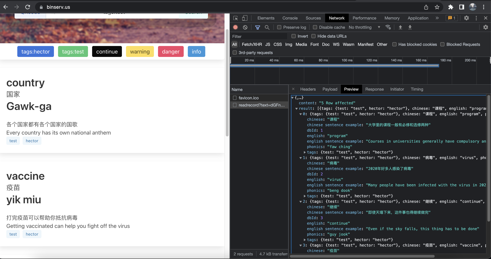

# Cantenese Dictionary Front-End-Portfolio-Project

## Hector

I will create an application using the dictionary API create by my own for data.

### User Stories

Two roll:

- Vistors
  - As a user, when I visit the website I see a links to single page and navigate all the function from it.
  - As a user I can type in the search input to search the keyword.
  - As a user I can click the qrcode button to gererate qrcode for the page.
  - As a user I can click on the preset tag to search a specific catalog.

  - As a user, if I try to submit with no entry in the input box, I see a the screen fill with most recent words that inputted.
  - As a user, I can click on a card it will connect me with google translate to pronounce the word in cantonese (working in process).

- Editors
  - As a editor, I can input the search a catelog of word or single word for edit.
  - As a editor, I can create and edit word and sentence with the page.
  - As a editor, the password is preset in the HTML file, so double click the file can edit with no hassle, with no cookies, and AES encryption, also if the file is protected will, for example in the mailbox, it only can breach by js injection on the browser.

### Data Snapshot

